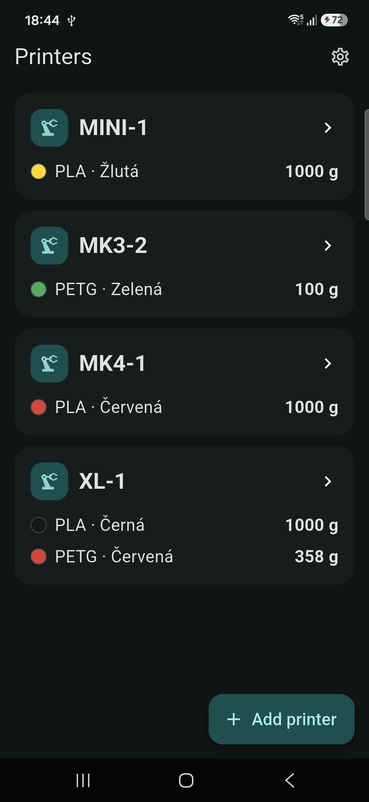
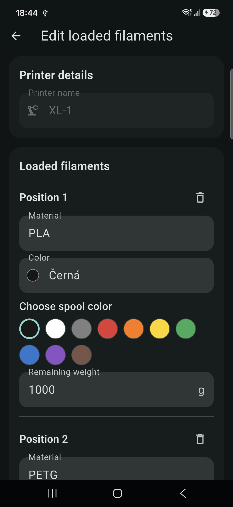
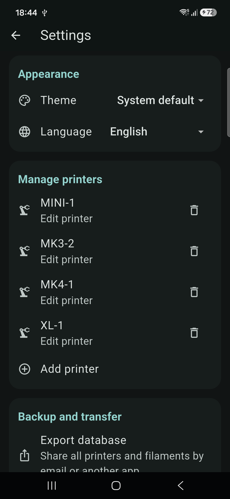
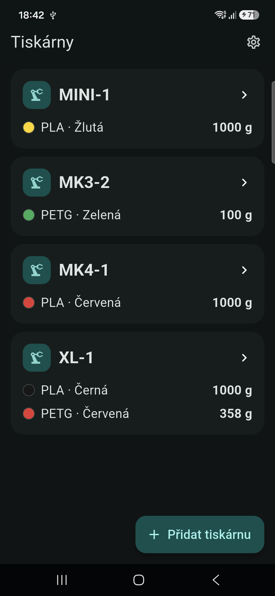
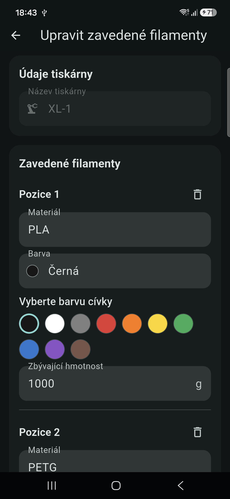
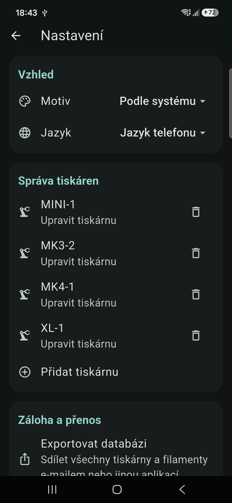

# Filament Manager


Filament Manager is an offline Android application for keeping track of the
filament that is currently loaded in a fleet of 3D printers. It provides a fast
shop-floor overview without requiring printer integrations, user accounts, a
server, or an internet connection.

The project is maintained by [Martin Pihrt](https://www.pihrt.com) and is
published at
[github.com/pihrt-com/filamentmanager-mobile-app](https://github.com/pihrt-com/filamentmanager-mobile-app).

## Screenshots

The screenshots below were captured from the application running on a real
Android phone.

### English

<p align="center">
  
  
  
</p>

### Czech

<p align="center">
  
  
  
</p>

## What the application does

The home screen displays every configured printer and the filament currently
loaded in it. Each printer card shows:

- the printer name, for example `MK3-1`, `MK4-1`, `XL-1`, or `Raise-1`;
- the material type, such as PLA, PETG, ASA, or a custom value;
- the user-defined color name and a visual color marker;
- the remaining filament weight in grams.

The overview is scrollable and adapts automatically to portrait, landscape,
phone, and wider-screen layouts.

On first launch, the application opens the **Add your first printer** screen.
After the printer name is entered, one or more loaded filament positions can be
added. A conventional printer can have one position, while a multi-material
printer such as an XL can have any number of independent positions. The data
model does not impose a manufacturer-specific slot limit.

Tapping a printer on the home screen opens its loaded-filament editor. The
material, color, selected color marker, and remaining weight can be changed
without accidentally renaming the printer. Printer names and printer removal
are managed separately in Settings.

## Features

- Offline inventory of printers and their currently loaded filament.
- Unlimited filament positions per printer.
- Material, color, visual color marker, and remaining weight for every position.
- Responsive portrait and landscape user interface.
- Light, dark, and system-default themes.
- English and Czech user interfaces.
- Android-style XML string catalogs used for all user-visible application text.
- Local SQLite storage with foreign-key integrity.
- No account, cloud service, analytics, or network connection required.
- Original Filament Manager launcher icon.
- Database backup, transfer, and restore.
- Separate printer management and loaded-filament editing flows.
- Architecture prepared for future OpenPrintTag NFC support.

## Backup and transfer

Settings contains a **Backup and transfer** section.

**Export database** creates a versioned JSON backup containing every printer and
all of its filament positions. Android's standard share sheet can send the file
through email, messaging, cloud storage, or another installed application.

**Import database** accepts a Filament Manager JSON backup and asks how it should
be applied:

- **Add to existing** keeps the current database and adds the imported printers.
  If an imported printer name already exists, a numeric suffix is added so that
  no existing record is overwritten.
- **Replace everything** atomically removes the current inventory and replaces
  it with the contents of the backup.

The backup contains a format identifier and schema version. Invalid or
unsupported files are rejected instead of being partially imported.

## Languages and XML strings

User-visible text is stored outside Dart source code in Android-style XML
catalogs:

```text
assets/i18n/values/strings.xml       English
assets/i18n/values-cs/strings.xml    Czech
```

The application follows the phone language by default. English or Czech can be
selected explicitly in Settings. A test verifies that both catalogs contain the
same set of string keys, making it safe to add further languages later.

## Supported Android versions

- Minimum: Android 12 (API level 31)
- Target: Android 16 (API level 36, latest stable API at the time of release)
- Package ID: `com.pihrt.filamentmanager.mobile`

The project can be opened directly in Android Studio with the Flutter and Dart
plugins installed. Open the repository root using **File > Open**.

## Privacy and storage

Printer and filament data is stored only in the application's private SQLite
database on the Android device. Filament Manager does not upload inventory or
personal data. Data leaves the device only when the user explicitly exports and
shares a backup.

## OpenPrintTag roadmap

The data model and user interface are prepared for a future NFC integration with
[OpenPrintTag](https://openprinttag.org/). The planned flow will allow a user to
select a printer position, tap an OpenPrintTag-compatible spool with the phone,
read material, color, and remaining weight, and write updated remaining weight
back to a rewritable tag.

NFC reading and writing are intentionally not enabled in the first release. The
first release remains fully usable with manual data entry.

## Project structure

```text
assets/i18n/       XML localization catalogs
assets/images/     Original application artwork
lib/data/          SQLite repository and versioned backup format
lib/localization/  XML localization loader
lib/models/        Printer and filament domain models
lib/theme/         Light and dark Material themes
lib/ui/            Responsive application screens
test/              Widget, localization, import, and backup tests
android/           Android package and release-signing configuration
```

## Development setup

Requirements:

- Flutter 3.47.1 or newer compatible stable release;
- Android Studio with Flutter and Dart plugins;
- Android SDK platform 36;
- Java 17 or the runtime bundled with Android Studio.

Install dependencies and run the checks:

```shell
flutter pub get
flutter analyze
flutter test
```

Run on a connected Android device:

```shell
flutter run
```

## Release signing

Release signing is intentionally kept outside the Git repository. The Android
build reads the following local file:

```text
%USERPROFILE%/android-keys/filamentmanager-mobile-signing.properties
```

Expected keys:

```properties
storeFile=C:/path/to/filamentmanager-mobile-upload
storePassword=secret
keyAlias=filamentmanager-mobile-upload
keyPassword=secret
```

Never commit the keystore or signing properties. The repository `.gitignore`
contains defensive rules for keystores and signing configuration.

Build release artifacts with:

```shell
flutter build apk --release
flutter build appbundle --release
```

The APK is intended for direct testing. The AAB is intended for Google Play,
where Play App Signing should manage the application's distribution key and the
local keystore should be registered as its upload key.

## Version

Current application version: **1.0.1 (build 2)**

Release date: **2026-08-25**

The version and release date are also visible in the application's Settings
screen together with the author and source-code links.

## License

Filament Manager is distributed under the GNU General Public License v3.0. See
the repository `LICENSE` file for the complete license text.
